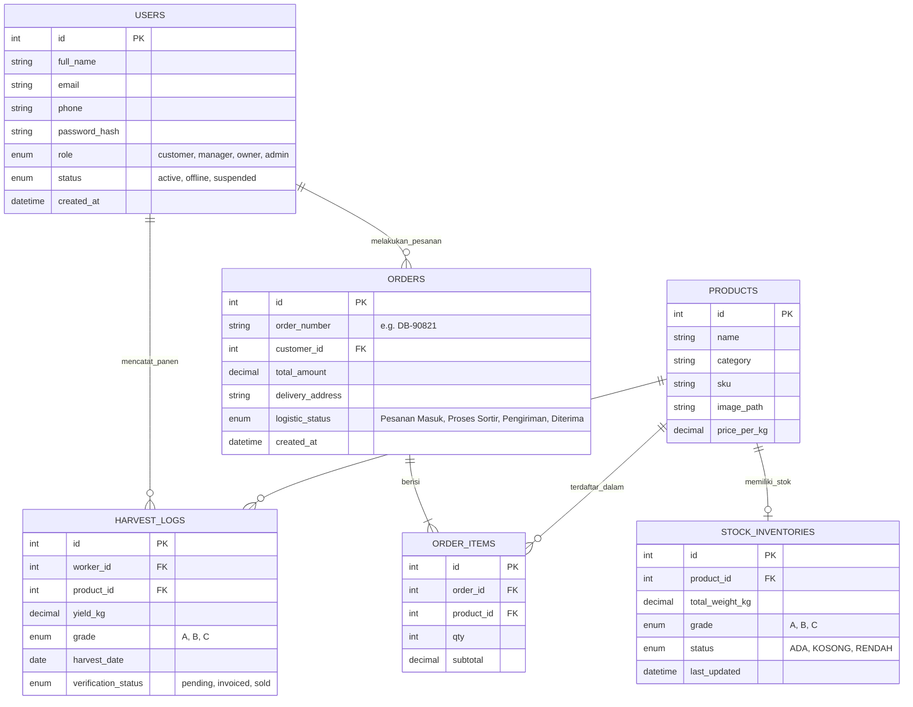

# Entity Relationship Diagram (ERD) - Greenhouse Database

Dokumen ini berisi struktur relasional dari database `db_greenhouse`. Diagram ini digambarkan menggunakan sintaks **Mermaid**. Jika Anda membuka file ini menggunakan Markdown viewer atau platform seperti GitHub / VSCode (dengan ekstensi Mermaid), gambarnya akan di-render secara visual.

## Deskripsi Singkat Tabel
1. **USERS**: Tabel sentral yang menampung multi-role akses ke sistem (Petani/Manager, Pemilik, Pembeli).
2. **PRODUCTS**: Katalog utama hasil pertanian (komoditas/sayuran).
3. **STOCK_INVENTORIES**: Tempat rekapitulasi data nyata berapa berat (`kg`) stok yang tersedia di lahan/gudang.
4. **HARVEST_LOGS**: Catatan historis atau jejak pelaporan hasil tani dari pekerja.
5. **ORDERS & ORDER_ITEMS**: Rekapitulasi transaksi pembelian oleh agen distribusi/pembeli.
